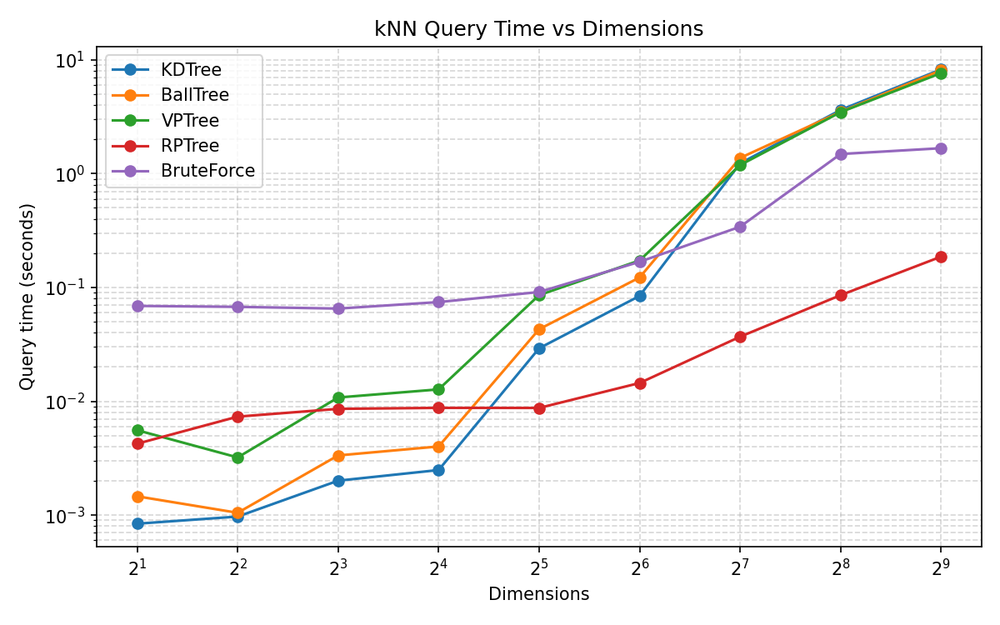

# Spatial Module
The spatial module holds a variety of tree structures, each possesing kNN, raidus and KDE queries. These queries function nearly the same in each, although pruning rules differ between. They each vastly speed up these queries and excel in different scenarios.
 
## Methods

### Tree Creation

```python
import ironforest as irn

#from ArrayLike input - python list, numpy array, ironforest array
data = ...

tree = irn.spatial.KDTree(
    data,
    leaf_size=20,
    metric="euclidean"
)

#from ironforest Array
data: Array = ...

tree = irn.spatial.KDTree.from_array(
    data,
    leaf_size=20,
    metric="euclidean"
)
```

### Radius Query

Find all points within a given radius of the query point.

```python
query = [0.5, 0.5]
radius = 0.2

result = tree.query_radius(query, radius)

print("indices:", result.indices)
print("distances:", result.distances)
```

### query_knn()

Find the k nearest neighbors to the query point.

```python
query = [0.5, 0.5]
k = 5

result = tree.query_knn(query, k)

print("nearest indices:", result.indices)
print("nearest distances:", result.distances)
```

### kernel_density()

Estimate kernel density at a single query point.

```python
query = [0.5, 0.5]

density = tree.kernel_density(
    query,
    bandwidth=0.1,
    kernel="gaussian",
    normalize=True
)

print("density:", density)
```

### Spatial Result

kNN & radius queries return a spatial result object. 

```python
result: SpatialResult = ...

#get standard outputs
print(result.indices)
print(result.distances)

#Get more comprehensive query results
print(result.centroid, result.median, result.quantile(0.1)) 

#split a batch query into a list of single queries
results = result.split()
```

`SpatialResult` currently supports:
- count, is_empty
- split - split a batch query into a list of singular queries
- mean, median
- max & radius, min
- var, std, quantile
- centroid

## Tree Selection

The following test was run on a randomly generated dataset with lowered intrinsic dimensionality than is displayed. RPTree used aNN while the other trees all performed exact kNN.



In low dimensions Ball or KD trees are generally the best choice. For a sensible default KDTree will suffice in most situations below 30dims.

In higher dimensions, RPTrees perform best and is by far the best choice when approximate aNN is acceptable. VPTree also theoretically stronger in higher dimensions, although in this dataset, by the time it overtakes KD & Ball trees, BruteForce is the best option for exact kNN. VPTree has the advantage of relying solely on a distance function for partitioning points. We currently only support a very limited set of distance functions but expect VPTree to support more than any our other trees in the future.

<div align="center">

| Dim | KDTree | BallTree | VPTree | RPTree | BruteForce |
|---|---|---|---|---|---|
| 2 | 0.000841 | 0.001464 | 0.005573 | 0.004241 | 0.068865 |
| 4 | 0.000972 | 0.001049 | 0.003213 | 0.007335 | 0.067560 |
| 8 | 0.002008 | 0.003346 | 0.010800 | 0.008584 | 0.065230 |
| 16 | 0.002491 | 0.004012 | 0.012726 | 0.008757 | 0.074408 |
| 32 | 0.029232 | 0.042956 | 0.085623 | 0.008744 | 0.091195 |
| 64 | 0.084272 | 0.122398 | 0.172642 | 0.014481 | 0.168071 |
| 128 | 1.230129 | 1.372778 | 1.188132 | 0.036921 | 0.341295 |
| 256 | 3.622376 | 3.486245 | 3.465098 | 0.085546 | 1.486208 |
| 512 | 8.233435 | 8.080198 | 7.639234 | 0.186495 | 1.671638 |

</div>

## Benchmarks

I benchmarked my trees against SKlearn by sampling 100,000 points uniformly in two dimensions between 0-1. We then ran 500 batched KDE queries for each tree using euclidian distance and gaussian kernels. Note that a uniformly generated dataset does not equate to real world use cases.


### Performance

**Radius & kNN Queries**

<div align="center">

| Dataset | Structure | Build (s) | kNN (s) | Radius (s) | k | radius |
|---|---|---|---|---|---|---|
| 10000x8 | sklearn.KDTree | 0.005848 | 0.289484 | 0.496998 | 10 | 0.5 |
| 10000x8 | sklearn.BallTree | 0.004917 | 0.466802 | 0.351760 | 10 | 0.5 |
| 10000x8 | irn.KDTree | 0.001696 | 0.013104 | 0.036566 | 10 | 0.5 |
| 10000x8 | irn.BallTree | 0.008095 | 0.058858 | 0.060451 | 10 | 0.5 |
| 50000x8 | sklearn.KDTree | 0.066481 | 0.390550 | 2.064392 | 10 | 0.5 |
| 50000x8 | sklearn.BallTree | 0.035018 | 0.910292 | 1.143048 | 10 | 0.5 |
| 50000x8 | irn.KDTree | 0.012981 | 0.028325 | 0.140391 | 10 | 0.5 |
| 50000x8 | irn.BallTree | 0.054803 | 0.114011 | 0.245173 | 10 | 0.5 |

</div>

One reason our implementations are faster is that queries are parallelized using rayon. We get a huge speed up running multiple queries simultaneously. Scikit-learn supports this through other methods but not on these trees directly. 

Another big reason for the increase is that once you make a IronForest Array, the data is already in our rust core. There is no handling of python objects input -> tree -> output all stays on the rust side of things. 

We currently don't support zero copy tree construction. All trees must duplicate the entire dataset before construction. This is because we reorder arrays internal to avoid cache misses but a zero copy option for our arrays is planned in the future. This would involve consuming the array leaving it in a dead state. The arrays original data can allways be retrieved by calling `tree.data()`. Alteratively we may consider not reordering arrays by default, allowing array consumption as an option to improve performance.

**Kernel Density Estimation**

<div align="center">
  
KDTree       | SKlearn      |  IronForest  | IronForest AggTree|
-------------|--------------|--------------|-------------------|
build_min    | 0.035439 sec | 0.014716 sec | 0.001253 sec      |
build_mean   | 0.037059 sec | 0.016116 sec | 0.001534 sec      |
query_min    | 2.204914 sec | 0.599856 sec | 1.2100e-05 sec    |
query_mean   | 2.252003 sec | 0.613925 sec | 1.6940e-05 sec    |

<br>

BallTree     | SKlearn      |  IronForest  | IronForest AggTree |
-------------|--------------|--------------|--------------------|
build_min    | 0.034704 sec | 0.020255 sec | 0.001253 sec       |
build_mean   | 0.037933 sec | 0.021643 sec | 0.001534 sec       |
query_min    | 1.890896 sec | 0.572458 sec | 1.2100e-05 sec     |
query_mean   | 2.019398 sec | 0.577282 sec | 1.6940e-05 sec     |


</div>
The approximation test is not fair to Scikit-Learn as we are comparing an exact computation to an approximation, I am just trying to convey that in cases where query speed really matters over accuracy, the aggregate tree approximation option is well worth trying.

### Accuracy
This test was a simple 20 point query against 100,000 points distributed norammly in 4 dimensions with a bandwidth of 0.5. Our aggregate tree used a max span of 1.0, which is extreme, this value really should never be set above the bandwidth.

Both results below are compared against scikit-learn's KdTree.

<div align="center">

KDTree                  |  IronForest KdTree  | IronForest AggTree|
------------------------|---------------------|-------------------|
Max Absolute Difference | 5.449846e-06        | 5.939465e+01      |
Mean Absolute Difference| 2.368243e-06        | 1.535262e+01      |


</div>

## General Optmizations
**Array Reordering:** The biggest speedup I've implemented so far was making the trees more cache friendly. Previously the data array remained untouched, while we manipulated an index array to deal with in-tree computations. This seemed fine in principle as we want to return the indices as our result, but it is not cache friendly. After adding a reorder function we increased speeds by 30% across queries. This function just rearranges our data vector so that nodes close to each other a stored nearby. This makes it easier for the CPU to cache values as we aren't jumping to random points in our arrays.

**Parallelization** via Rayon is another huge win for batch queries. All our trees do this automatically, where if a query size is great enough it is split across cores. Because of the nature of these spatial queries each core is traversing a tree that won't be mutated at least until the query is over. This makes implementation as simple as using rayon's parallel iterator instead of a standard loop.

**SIMD Instructions**: We currently use SIMD for euclidean distance and computing dot products for random projection trees. This gives us another solid boost as euclidean distance metrics are extemely common and dot products are used every step of the way on RPTrees. 


